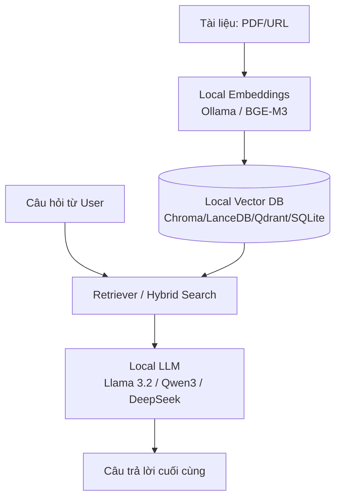
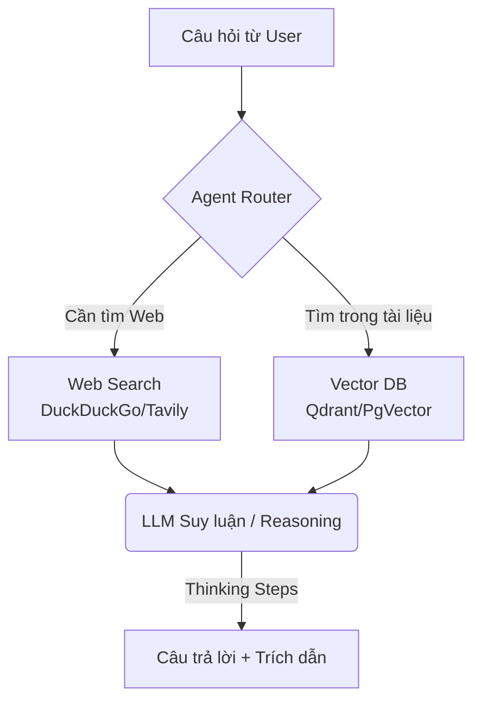
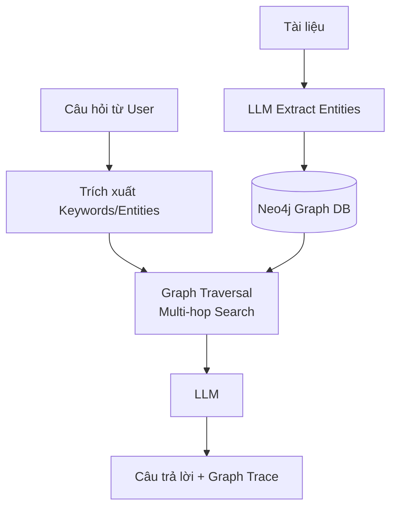
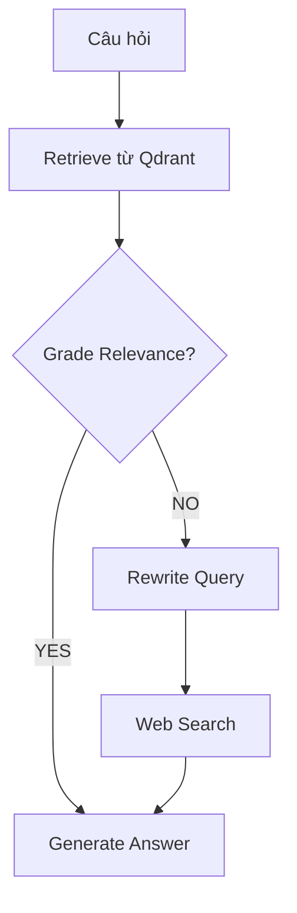
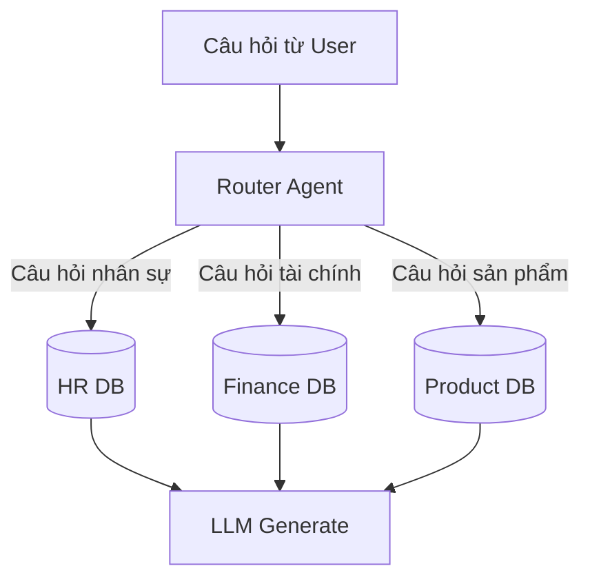
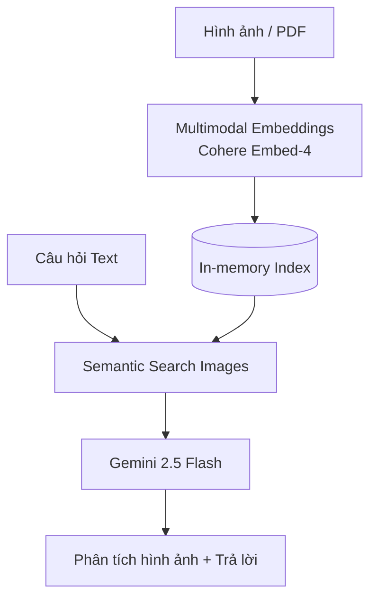

# 🚀 Workflow & Hướng Dẫn Sử Dụng 22 RAG Apps

Tài liệu này cung cấp sơ đồ kiến trúc (workflow) và hướng dẫn sử dụng chi tiết cho bộ 22 ứng dụng RAG trong thư mục `rag_tutorials`. Thay vì vẽ 22 sơ đồ riêng biệt, hệ thống được nhóm thành **6 mô hình kiến trúc RAG cốt lõi**.

---

## 🏗️ 1. Local & Privacy-First RAG Workflow
**Áp dụng cho:** App 1, 9, 13, 14, 15, 16

Mô hình này hoàn toàn chạy offline trên máy cá nhân, bảo mật 100% dữ liệu.



### 📖 Hướng dẫn sử dụng Local RAG:
1. **Cài đặt Ollama** và pull các model cần thiết:
   ```bash
   ollama pull llama3.2
   ollama pull embeddinggemma
   ```
2. Nếu dùng Qdrant Local (App 15), khởi động Docker:
   ```bash
   docker run -p 6333:6333 qdrant/qdrant
   ```
3. Chạy ứng dụng (Ví dụ App 13):
   ```bash
   cd rag_tutorials/llama3.1_local_rag
   python -m venv .venv && source .venv/bin/activate
   pip install -r requirements.txt
   streamlit run llama3.1_local_rag.py
   ```
4. Giao diện hiện ra, upload tài liệu hoặc dán URL, sau đó bắt đầu đặt câu hỏi.

---

## 🤖 2. Agentic RAG Workflow
**Áp dụng cho:** App 2, 3, 4, 6, 10, 18

Trong Agentic RAG, AI hoạt động như một "Đặc vụ" (Agent) có khả năng tự suy luận, lập kế hoạch, và sử dụng công cụ như Web Search (Tavily/Exa) khi Vector DB không đủ thông tin.



### 📖 Hướng dẫn sử dụng Agentic RAG:
1. Yêu cầu **API Key**: Cần có `OPENAI_API_KEY`, `GOOGLE_API_KEY`, và đôi khi là API Web Search (`TAVILY_API_KEY`, `EXA_API_KEY`).
2. Khởi tạo môi trường:
   ```bash
   export OPENAI_API_KEY="sk-..."
   export TAVILY_API_KEY="tvly-..."
   ```
3. Chạy app (Ví dụ App 4 - Agentic RAG with Reasoning):
   ```bash
   cd rag_tutorials/agentic_rag_with_reasoning
   streamlit run rag_reasoning_agent.py
   ```

---

## 🧠 3. Knowledge Graph RAG (GraphRAG) Workflow
**Áp dụng cho:** App 12

Thay vì chỉ tìm theo vector (semantic), GraphRAG trích xuất các "Thực thể" (Entities) và "Mối quan hệ" (Relationships) để lưu vào Neo4j, giúp trả lời các câu hỏi phức tạp cần kết nối nhiều thông tin.



### 📖 Hướng dẫn sử dụng Knowledge Graph RAG:
1. Chạy Docker cho Neo4j:
   ```bash
   docker run -d --name neo4j -p 7474:7474 -p 7687:7687 -e NEO4J_AUTH=neo4j/password neo4j:latest
   ```
2. Mở App 12, tải tài liệu lên. App sẽ mất một lúc để xây dựng Graph.
3. Hỏi các câu hỏi đòi hỏi tư duy kết nối (Ví dụ: "Công ty A và người B có mối liên hệ gì?").

---

## 🛠️ 4. Corrective RAG (CRAG) Workflow
**Áp dụng cho:** App 8

Hệ thống có cơ chế tự đánh giá (Grade) chất lượng tài liệu tìm được. Nếu tài liệu không liên quan, nó sẽ tự động viết lại câu hỏi (Rewrite Query) và tìm kiếm thêm trên Web.



### 📖 Hướng dẫn sử dụng Corrective RAG:
- Khi chạy App 8, bạn sẽ thấy Logs của hệ thống báo rõ: `Document Relevant: Yes/No`. Nếu `No`, hệ thống sẽ kích hoạt công cụ Web Search để sửa sai tự động. Cần có `TAVILY_API_KEY`.

---

## 🔀 5. Database Routing RAG Workflow
**Áp dụng cho:** App 20

Có nhiều loại tài liệu khác nhau (HR, Finance, Tech Support). Agent sẽ phân tích câu hỏi và chọn đúng cơ sở dữ liệu để tìm kiếm.



### 📖 Hướng dẫn sử dụng Database Routing:
- Trong App 20, bạn cần upload tài liệu vào đúng danh mục trên giao diện. Khi bạn hỏi, bạn sẽ thấy Router Agent tự quyết định chuyển hướng truy vấn đến DB nào.

---

## 👁️ 6. Vision RAG Workflow
**Áp dụng cho:** App 22

RAG hỗ trợ đa phương thức. Không chỉ text, mà còn xử lý cả Hình ảnh và Biểu đồ trong PDF.



### 📖 Hướng dẫn sử dụng Vision RAG:
1. Cần có `COHERE_API_KEY` (để embedding đa phương thức) và `GOOGLE_API_KEY` (để dùng Gemini 2.5).
2. Khi chạy App 22, upload hình ảnh PNG/JPG hoặc PDF chứa nhiều đồ thị.
3. Đặt câu hỏi: "Biểu đồ trong hình cho thấy xu hướng gì?".

---
